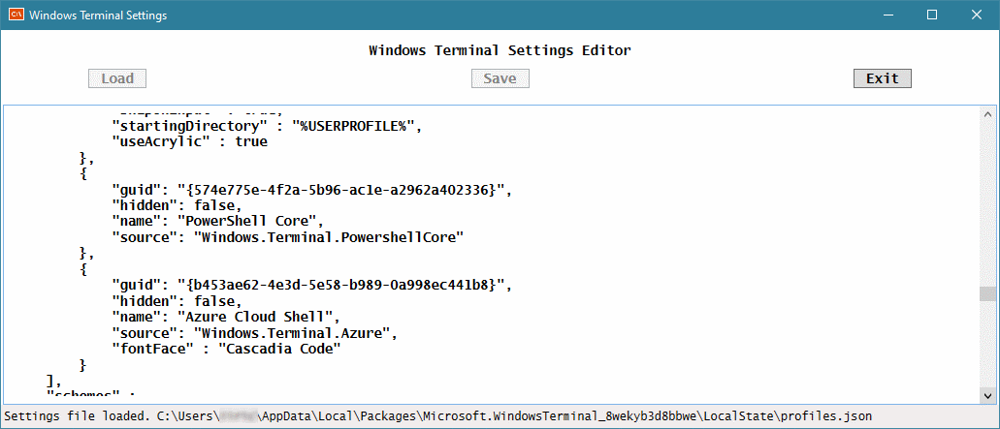

# Windows Terminal Settings app

This is a simple Windows application that helps with editing Windows Terminal Settings.
You can learn more about Windows Terminal at [their GitHub web pages](https://github.com/microsoft/terminal).
Created as part of [HacktoberFest 2019 by DigitalOcean](https://hacktoberfest.digitalocean.com/).

## Screenshots

Application version 1.0

## Build status

The source code is continuously checked against master branch on [Azure Pipelines](https://azure.microsoft.com/en-us/services/devops/pipelines/).

